

	

<h1 align="center" style="margin: 30px 0 30px; font-weight: bold;">微筹 - 众筹网站</h1>
<h4 align="center">基于SpringBoot + Vue 3前后端分离的项目</h4>

> 平台以Spring Boot框架为核心搭建了整个项目的后端，以SpringSecurity、Java Web Token为辅助帮助解决用户登录等问题，通过Naive的前端UI框架及Vue3，来搭建前端用户的页面，并且以常用的关系型数据库Mysql数据库，来作为平台的数据库使用。系统整体设计思想是以B/S架构为核心，JDK1.8为开发环境进行开发。
## 项目截图

<table>
    <tr>
        <td>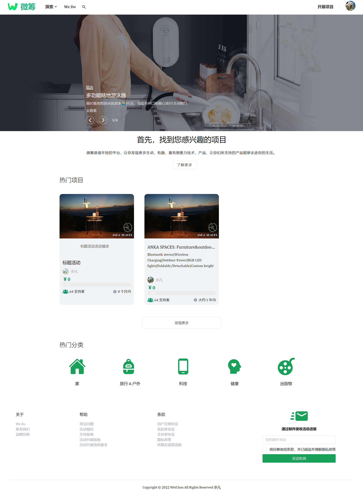主页</td>
        <td>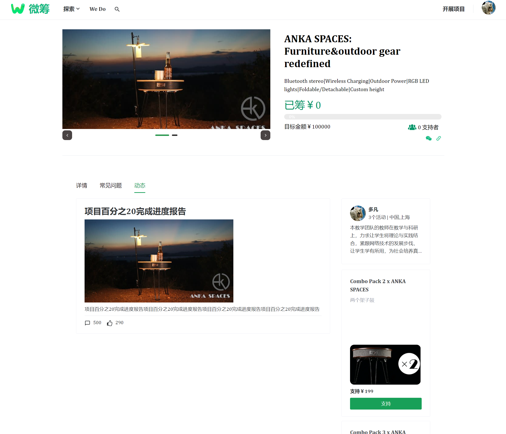</td>
   <tr>
    <tr>
        <td>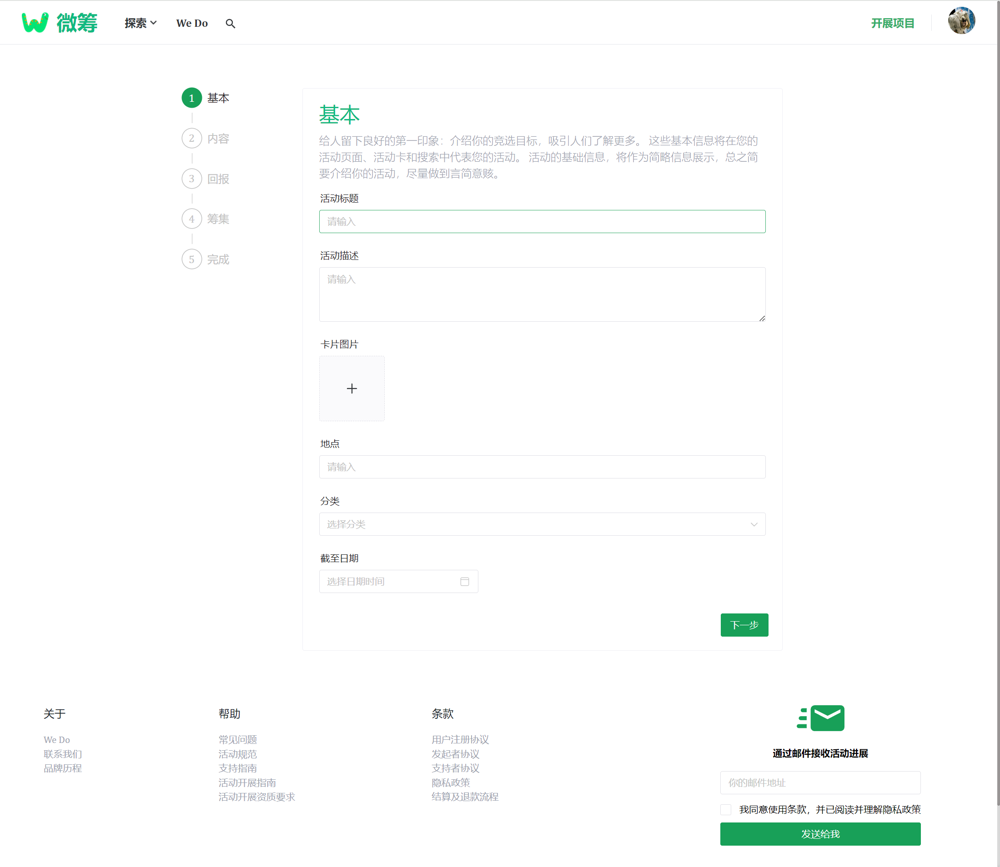</td>
        <td>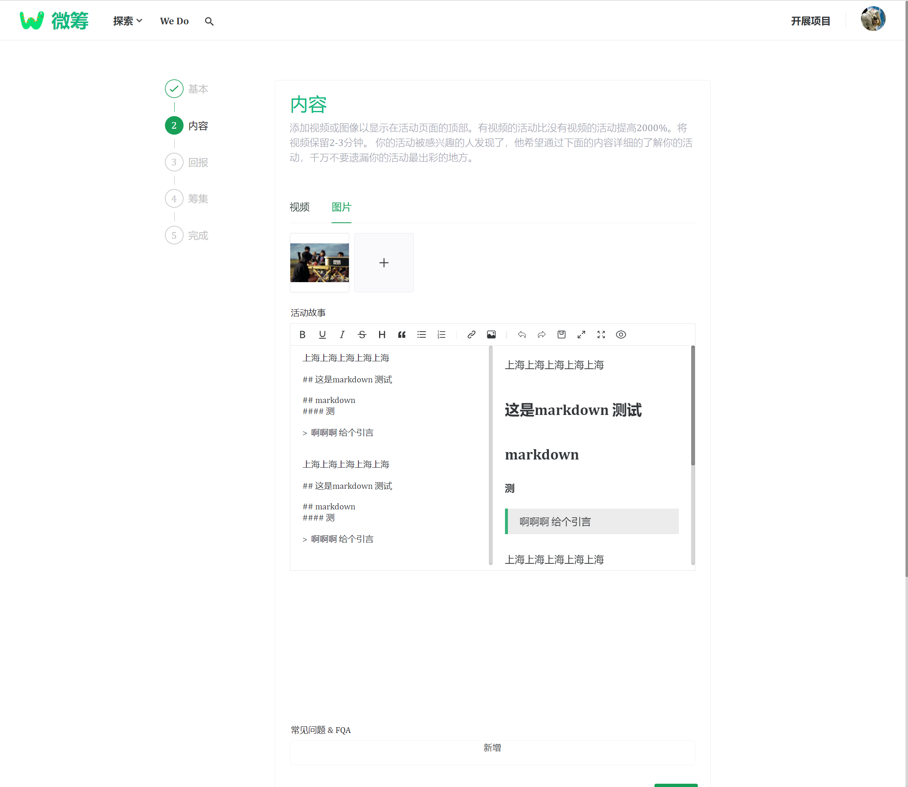</td>
    </tr>
    <tr>
        <td>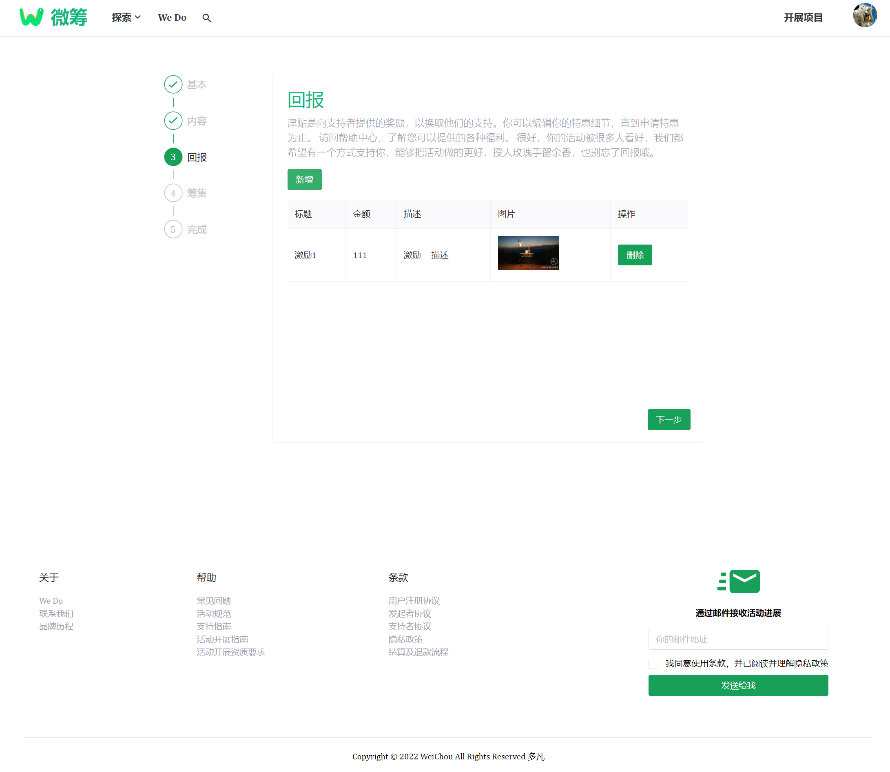</td>
        <td>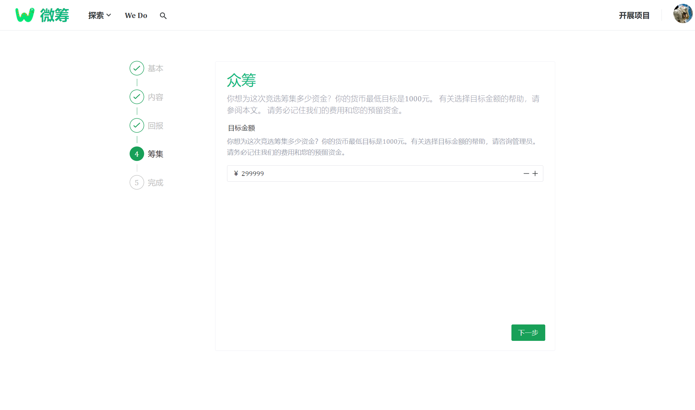</td>
    </tr>
	<tr>
        <td>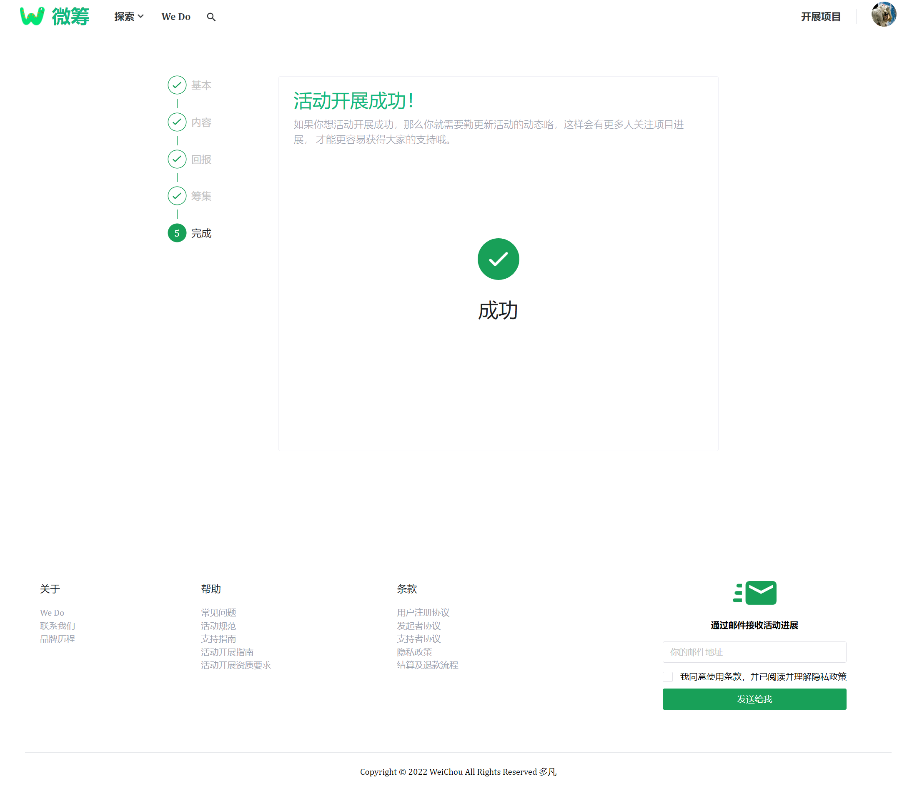</td>
        <td>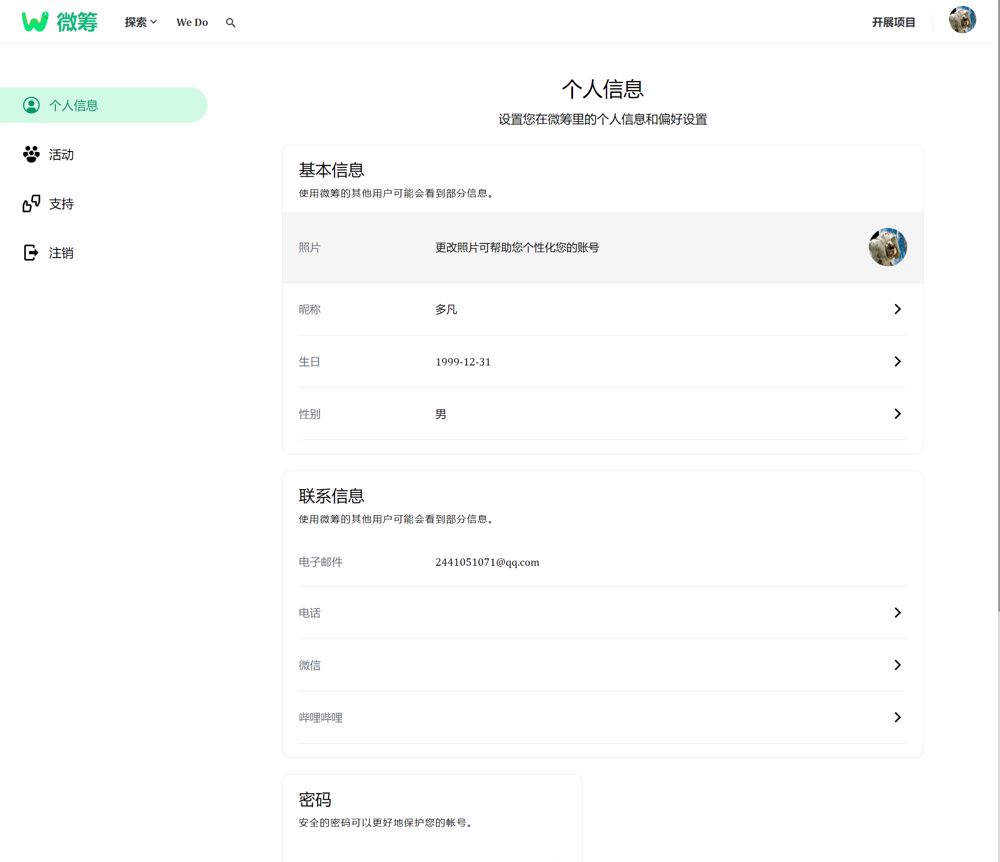用户中心 模仿的google用户</td>
    </tr>	 
    <tr>
        <td>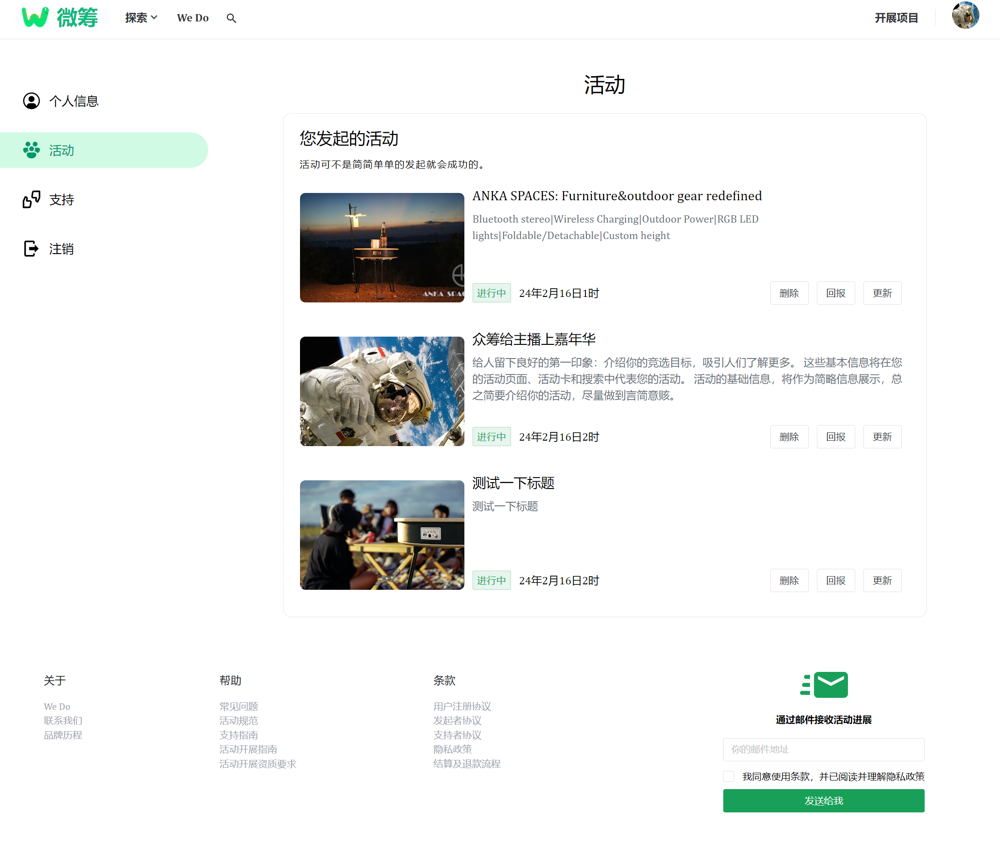</td>
        <td>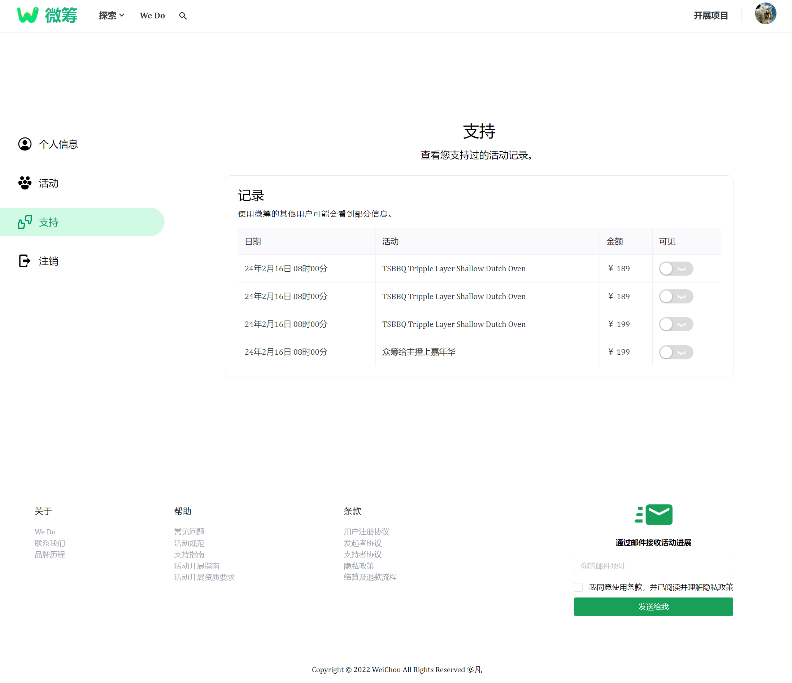</td>
    </tr>
	<tr>
        <td>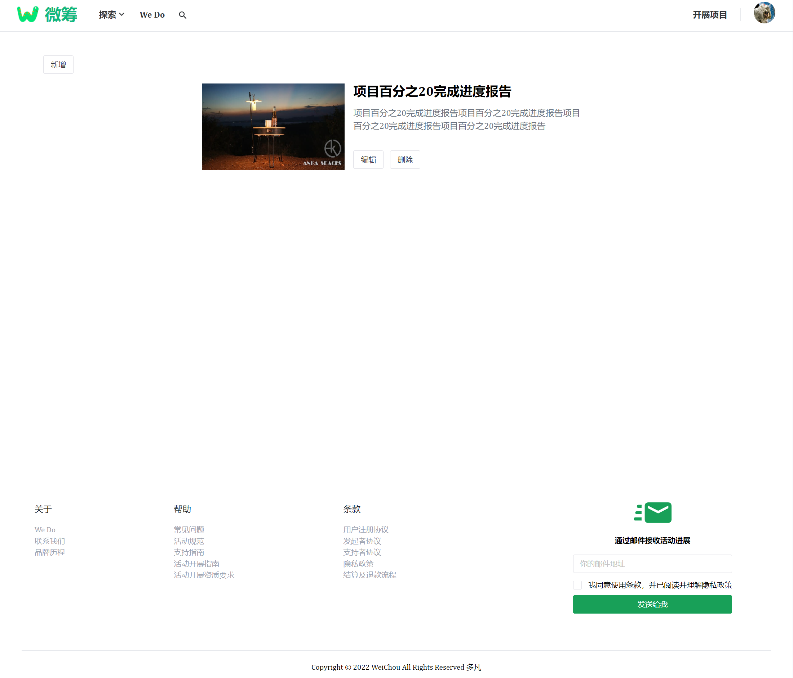项目进度更新</td>
    </tr>
  <tr>
   <td>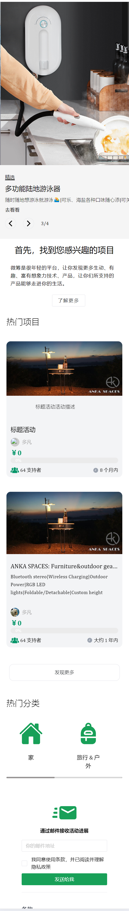主页 - 手机端适配</td>
  </tr>
</table>

## 内置功能

1. 用户登录
描述： 该部分侧重于用户认证的过程。用户需要提供有效的凭据，如用户名和密码，以访问系统。成功登录授予用户访问个性化内容和功能的权限。

2. 注册
描述： 该部分概述了新用户在系统中创建账户的过程。用户通常需要提供基本信息，创建用户名和密码，并通过电子邮件或其他方式验证其身份。注册使用户能够使用个性化账户访问系统。

3. 开展活动
该部分详细介绍了在系统中创建、管理和参与活动的功能。用户可以创建新的活动，设置日期和地点等详细信息，邀请其他人，并管理活动的整体流程。发布后的活动，发布者可以更新活动的紧张状态。

4. 活动检索
 该部分解释了用户如何在系统中搜索特定的活动或事件。这可能涉及到筛选器、搜索条件和排序选项，以帮助用户根据其偏好、兴趣或位置找到相关活动。

5. 个人中心
该部分侧重于用户在系统中的个人空间。用户可以查看和管理其个人资料信息，跟踪其活动，回顾过去的事件，并可能自定义设置。个人中心作为用户特定交互和自定义的中心。

## 项目使用
backend 目录是后端，使用idea 打开，依赖安装好后，run就可以，数据库创建好，不需要创建表，会自动生成（或者可以选择使用init.sql sql 语句）

frontend 目录是前端，使用vite2，编译打包迅速，使用 yarn 命令或者npm i 命令安装依赖，然后使用yarn dev  或者 npm run dev 运行前端即可，

## 开源不易 ，star鼓励

技术交流群 473628965

